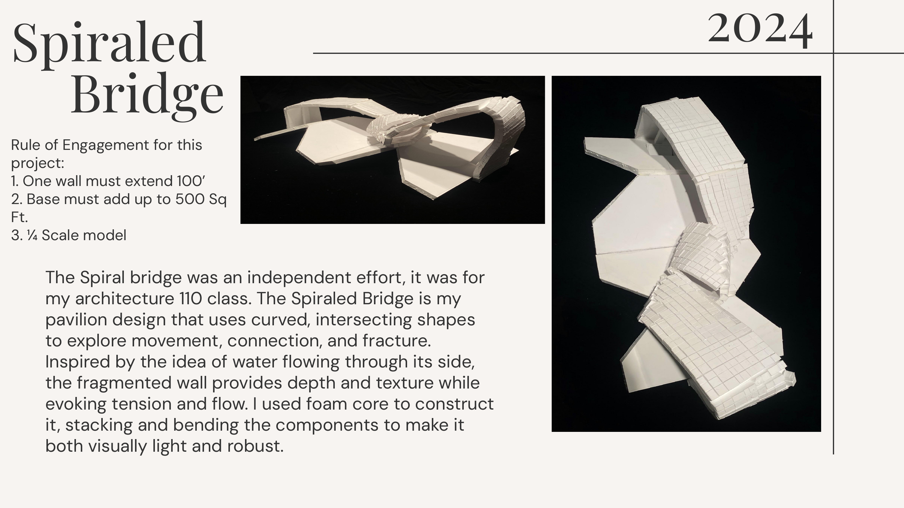
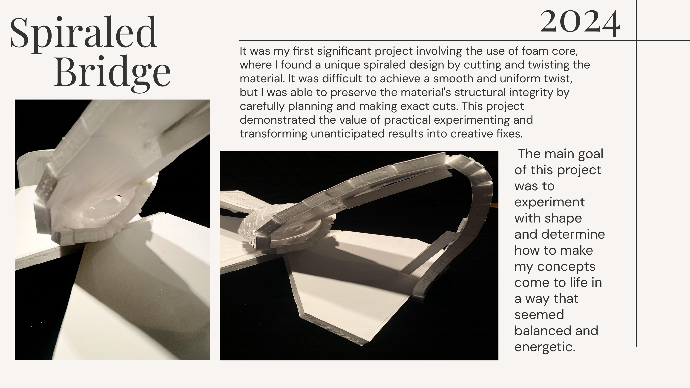
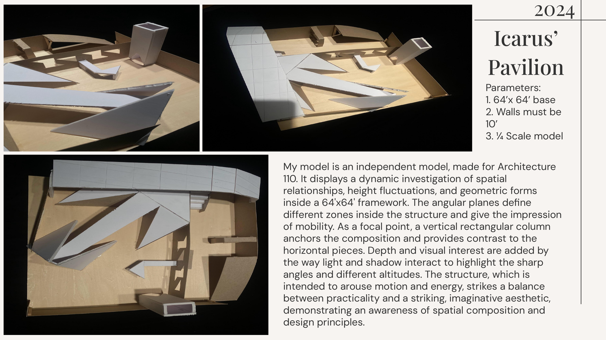
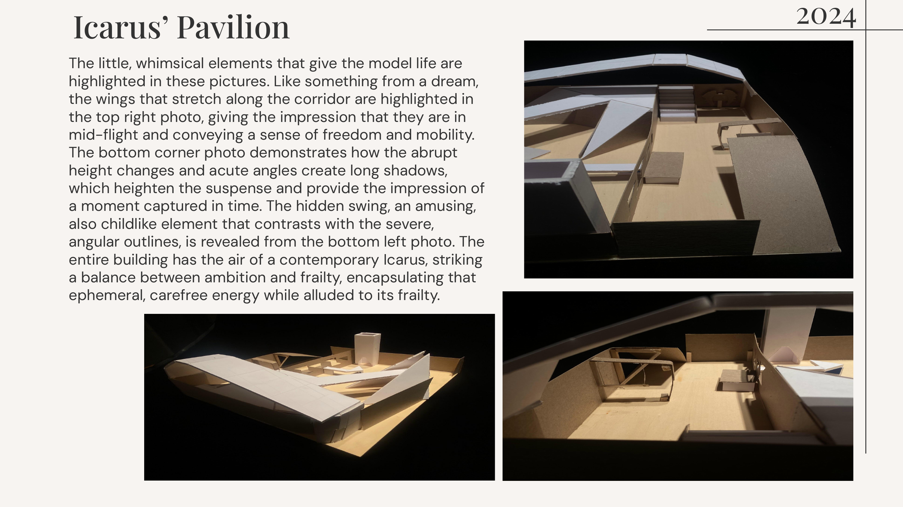
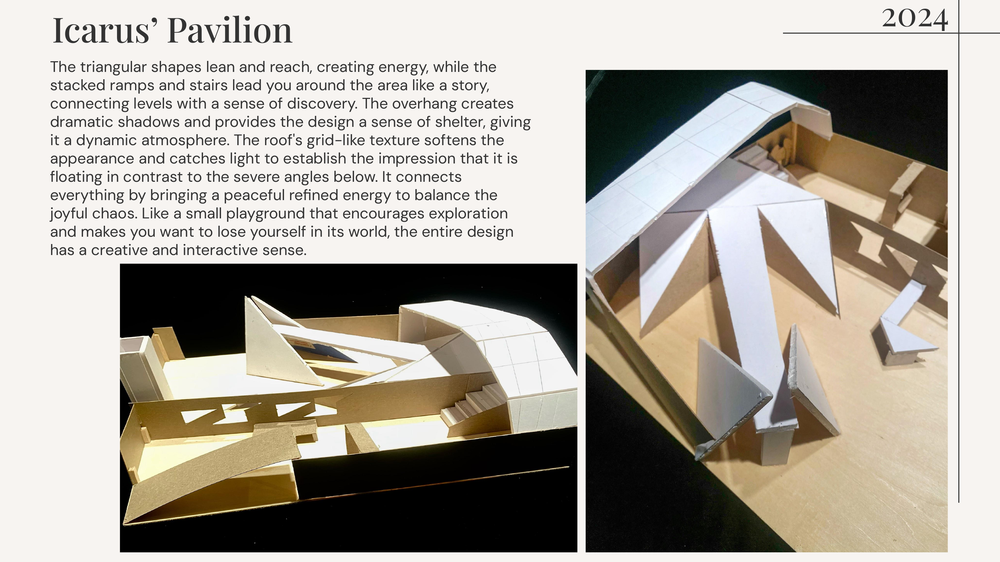
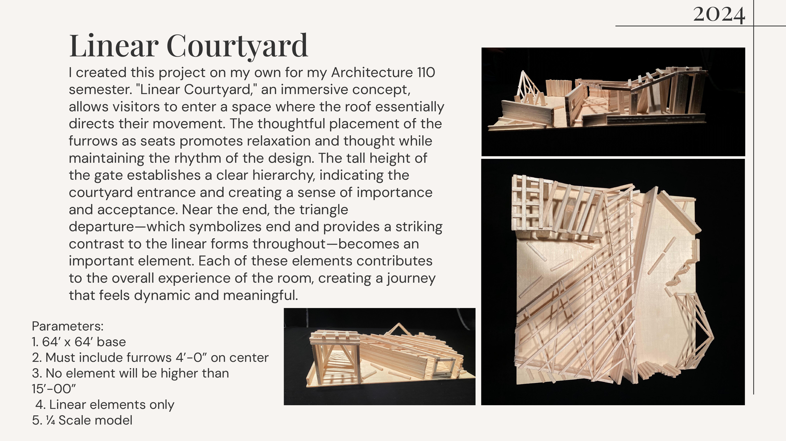
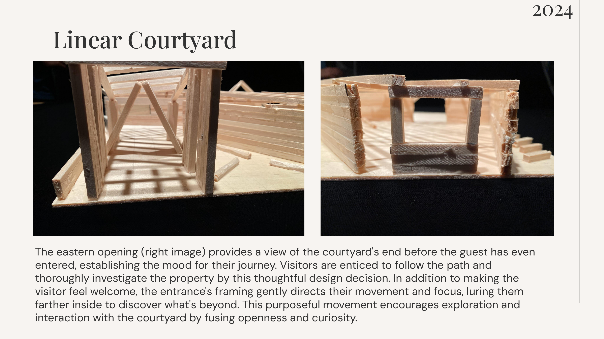
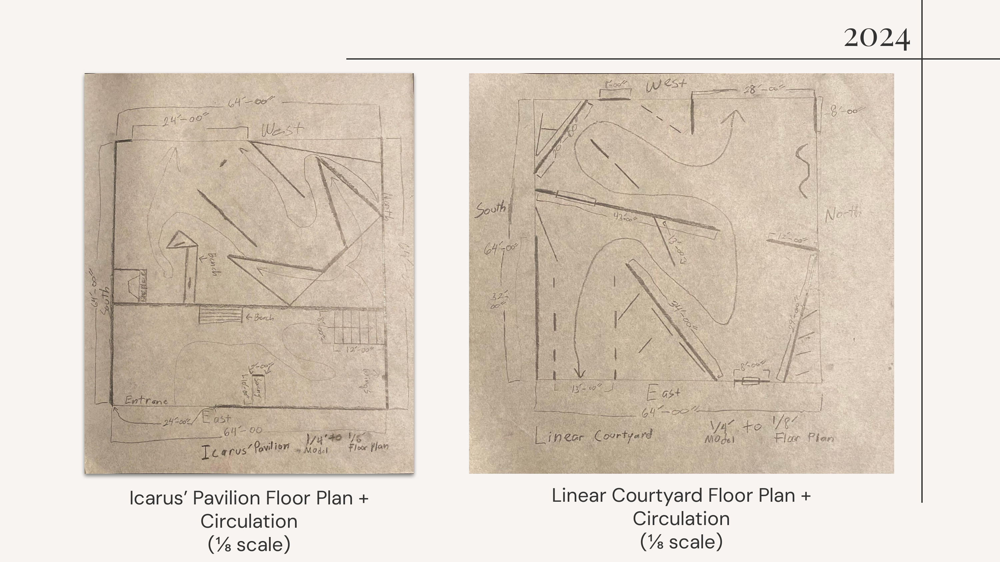

<html lang="en">
<head>
    <meta charset="UTF-8">
    <meta name="viewport" content="width=device-width, initial-scale=1.0">
    <title>Anthony Pineda - Architectural Portfolio</title>
    
</head>
<body>
    <header>
        <h1>Anthony Pineda</h1>
        
Architectural Portfolio 2025

        
Fairfax, CA | anthpin3da@gmail.com | (415)-902-4065

    </header>

    

        

            <h2>Spiraled Bridge</h2>
            
            
        

        

            <h2>Icarus’ Pavilion</h2>
            
            
            
        

        

            <h2>Linear Courtyard</h2>
            
            
             

        

            <h2>Floor Plans</h2>
            
        

    

    <footer>
        
&copy; 2025 Anthony Pineda. All rights reserved.

    </footer>
</body>
</html>
